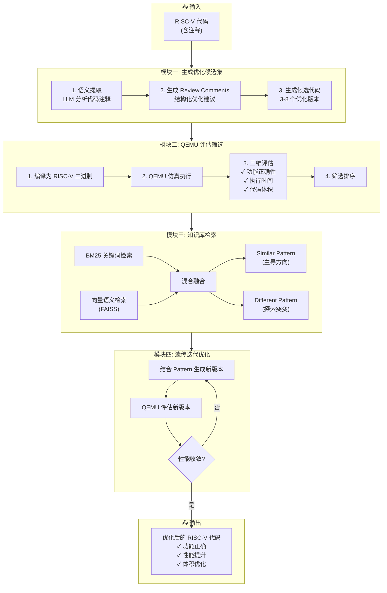
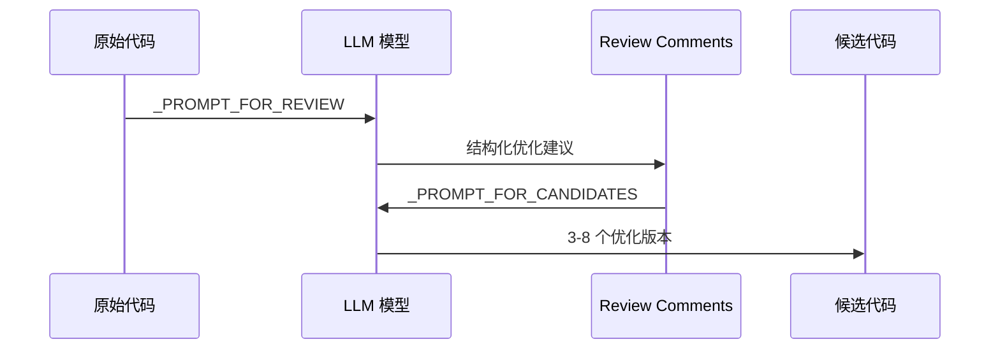

# SBLLM - RISC-V 代码自动优化框架

> 基于 ICSE'25 论文《Search-Based LLMs for Code Optimization》的 RISC-V 深度定制版本

---

## 1. 项目简介 (Project Overview)

### 1.1 项目描述

本项目是一个**基于大语言模型（LLM）的代码自动优化框架**，专门针对 RISC-V 架构进行了深度定制和增强。框架采用**搜索式优化策略（Search-Based Optimization）**，结合遗传算法思想，通过多轮迭代生成、评估、筛选优化候选代码，最终输出功能正确且性能提升的 RISC-V 代码。

**核心问题**：如何自动化地将代码迁移并优化到 RISC-V 架构？

**解决方案**：
1. 使用 LLM 分析代码注释，生成结构化的优化建议
2. 基于优化建议生成多个候选优化代码
3. 在 QEMU 仿真环境中验证功能正确性和性能
4. 通过知识库检索复用历史优化经验
5. 使用遗传算法迭代优化，持续改进代码性能

### 1.2 核心功能 (Key Features)

| 功能 | 描述 |
|------|------|
| 🎯 **自动化优化** | 无需手动分析，自动生成 3-8 个优化候选 |
| 🔍 **智能检索** | BM25 + 向量混合检索，复用历史优化模式 |
| ✅ **严格验证** | QEMU 仿真环境确保功能正确性和性能提升 |
| 🚀 **遗传迭代** | 遗传算法驱动的持续优化，自动收敛 |
| 🧠 **多模型支持** | 支持 GPT-4、Gemini、DeepSeek、CodeLlama |
| ⚡ **性能优化** | 编译缓存 + 并行评估，5-10 倍速度提升 |

---

## 2. 项目结构分析 (Project Structure)

```
project1-sbllm/
├── sbllm/                          # 主项目目录
│   ├── sbllm/                      # 核心代码包
│   │   ├── core/                   # 核心模块
│   │   │   ├── llm_client.py       # LLM API 统一调用客户端
│   │   │   ├── llm_config.py       # LLM 配置管理
│   │   │   └── arg_parser.py       # 命令行参数解析
│   │   ├── prompts/                # Prompt 模板
│   │   │   ├── templates.py        # RISC-V 优化 Prompt 模板
│   │   │   └── builder.py          # Prompt 构建工具
│   │   ├── utils/                  # 工具模块
│   │   │   ├── qemu_evaluator.py   # QEMU 仿真评估器
│   │   │   ├── riscv_compiler.py   # RISC-V 编译器封装
│   │   │   ├── code_abstractor.py  # 代码抽象化工具
│   │   │   ├── retrieval_utils.py  # 检索工具
│   │   │   └── code_utils.py       # 代码处理工具
│   │   ├── evol_query.py           # ⭐ 遗传优化主模块
│   │   ├── merge.py                # ⭐ 知识库检索与合并
│   │   ├── execution.py            # ⭐ 评估执行调度
│   │   ├── initial.py              # 初始化模块
│   │   ├── run_riscv.sh            # 一键运行脚本
│   │   └── test_riscv.sh           # 测试脚本
│   ├── baselines/                  # 基线方法（COT, ICL, RAG 等）
│   ├── processed_data/             # 处理后的数据集
│   ├── output/                     # 优化结果输出
│   ├── requirement.txt             # Python 依赖
│   └── Dockerfile                  # Docker 环境配置
└── 需求文档*.docx                   # 项目需求文档
```

### 核心文件说明

| 文件 | 作用 |
|------|------|
| [evol_query.py](file:///c:/Users/65783/Desktop/project1-sbllm/sbllm/sbllm/evol_query.py) | 遗传优化主逻辑：生成 Review Comments、候选代码生成、迭代优化 |
| [merge.py](file:///c:/Users/65783/Desktop/project1-sbllm/sbllm/sbllm/merge.py) | 知识库检索：BM25/向量/混合检索，获取 Similar/Different Pattern |
| [execution.py](file:///c:/Users/65783/Desktop/project1-sbllm/sbllm/sbllm/execution.py) | 评估调度：调用 QEMU 评估器，生成执行报告 |
| [qemu_evaluator.py](file:///c:/Users/65783/Desktop/project1-sbllm/sbllm/sbllm/utils/qemu_evaluator.py) | QEMU 评估器：编译、运行、测量、正确性验证 |
| [templates.py](file:///c:/Users/65783/Desktop/project1-sbllm/sbllm/sbllm/prompts/templates.py) | Prompt 模板：Review、Candidates、Evolution 三阶段 Prompt |

---

## 3. 核心逻辑与架构 (Core Logic & Architecture)

### 3.1 系统架构图



### 3.2 核心模块详解

#### 模块一：生成优化候选集 (`evol_query.py`)

**核心函数**：
- `generate_review_comments()` - 分析代码注释，生成结构化优化建议
- `prompt_construction()` - 构建 LLM Prompt
- `generic_llm_worker()` - 调用 LLM 生成候选代码

**处理流程**：


#### 模块二：QEMU 评估筛选 (`qemu_evaluator.py`)

**核心类**：`QEMURISCVEvaluator`

**关键特性**：
- ✅ **编译缓存**：基于代码哈希缓存编译结果
- ✅ **并行评估**：`ThreadPoolExecutor` 并行处理多个候选
- ✅ **功能验证**：输出比较 + 数值容差 + 返回码检查

**评估指标**：
| 指标 | 说明 |
|------|------|
| `is_correct` | 功能正确性（输出匹配） |
| `execution_time` | 执行时间（多次平均） |
| `code_size` | 代码段大小（字节） |
| `speedup_ratio` | 加速比 = 1 - new_time/old_time |

#### 模块三：知识库检索 (`merge.py`)

**检索策略**：
| 方法 | 说明 |
|------|------|
| `bm25` | BM25 关键词匹配 |
| `vector` | Sentence-Transformers + FAISS 语义检索 |
| `hybrid` | 加权融合（默认 α=0.5） |

**检索结果**：
- **Similar Pattern**：与当前代码最相似的优化模式（主导方向）
- **Different Pattern**：语义相似但优化逻辑不同的模式（探索突变）

#### 模块四：遗传迭代优化 (`evol_query.py`)

**遗传算法思想**：
```
Similar Pattern → 稳定优化（继承优秀基因）
Different Pattern → 探索突变（引入新基因）
QEMU 评估 → 适应度函数（自然选择）
迭代收敛 → 进化终止条件
```

---

## 4. 快速开始 (Getting Started)

### 4.1 环境要求

- **操作系统**：Linux（推荐 Ubuntu 20.04+）
- **Python**：3.9.12
- **外部工具**：
  - QEMU RISC-V 仿真器 (`qemu-riscv64`)
  - RISC-V GCC 工具链 (`riscv64-unknown-linux-gnu-gcc`)

### 4.2 安装依赖

```bash
# 1. 克隆项目
cd project1-sbllm/sbllm

# 2. 安装 Python 依赖
pip install -r requirement.txt

# 3. 安装 QEMU（Ubuntu/Debian）
sudo apt-get install qemu-user-riscv64

# 4. 安装 RISC-V GCC 工具链
# 下载预编译版本并解压到 /opt/riscv64-unknown-linux-gnu
```

### 4.3 配置 API 密钥

编辑 `sbllm/sbllm/evol_query.py`，填入 API 密钥：

```python
deepseek_api_keys = ["your-deepseek-api-key"]  # 推荐
openai_api_keys = ["your-openai-api-key"]
gemini_api_keys = ["your-gemini-api-key"]
```

或使用环境变量（`.env` 文件）：
```bash
DEEPSEEK_API_KEY=your-deepseek-api-key
OPENAI_API_KEY=your-openai-api-key
```

### 4.4 验证环境

```bash
cd sbllm/sbllm
python utils/validate_riscv_setup.py \
    --qemu_path /usr/bin/qemu-riscv64 \
    --riscv_gcc_toolchain_path /opt/riscv64-unknown-linux-gnu
```

### 4.5 运行优化

```bash
# 一键运行（推荐）
bash run_riscv.sh \
    --qemu_path /usr/bin/qemu-riscv64 \
    --riscv_gcc_toolchain_path /opt/riscv64-unknown-linux-gnu

# 快速测试（首次使用）
bash test_riscv.sh \
    --qemu_path /usr/bin/qemu-riscv64 \
    --riscv_gcc_toolchain_path /opt/riscv64-unknown-linux-gnu

# 使用容器运行的样例（我在我的环境下运行的命令）
docker exec project1-dev bash -c "cd /app/sbllm && bash run_riscv.sh --qemu_path /usr/bin/qemu-riscv64 --riscv_gcc_toolchain_path /opt/riscv > ../run.log 2>&1"
```

### 4.6 查看结果

```bash
# 最终结果
cat output/riscv/riscv_optimization/results.jsonl

# 评估报告
cat output/riscv/riscv_optimization/4/test_execution_*.report
```

---

## 附录：技术栈总结

| 类别 | 技术 |
|------|------|
| **LLM API** | OpenAI GPT-4, Google Gemini, DeepSeek, CodeLlama |
| **仿真环境** | QEMU RISC-V (qemu-riscv64) |
| **编译工具** | RISC-V GCC 工具链 |
| **检索引擎** | BM25 (rank_bm25) + FAISS |
| **向量编码** | Sentence-Transformers (all-MiniLM-L6-v2) |
| **优化算法** | 遗传算法 (Genetic Algorithm) |
| **代码分析** | Tree-sitter |

---

*文档生成时间：2026-01-08*
